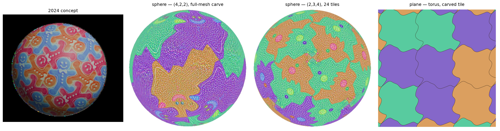

<p align="center">
  
</p>

<h1 align="center">Generative Spherical Orbifold</h1>

<p align="center">
  Escher-style tilings, generated from a text prompt and wrapped seamlessly around a sphere.<br>
  Emilio Sánchez-Harris &amp; <a href="https://github.com/nikhitrivedi1">Nikhil Trivedi</a>, advised by Dr.&nbsp;Crane Chen · started 2024, completed 2026
</p>

---

Give it a prompt ("gingerbread man") and it produces a closed spherical surface tiled
with that figure in the style of M.C. Escher — every tile interlocking with its
neighbors, no gaps and no overlaps, certified: the tiled mesh's signed solid angles sum
to exactly 4π with zero inverted faces.

Built on **[Generative Escher Meshes](https://github.com/thibaultgroueix/GenerativeEscherMeshes)**
(Aigerman &amp; Groueix, SIGGRAPH 2024 — [paper](https://arxiv.org/abs/2309.14564)),
extended from flat wallpaper tilings to closed spherical surfaces using
**[Spherical Orbifold Tutte Embeddings](https://github.com/noamaig/spherical_orbifolds)**
(Aigerman &amp; Lipman, SIGGRAPH 2017). The leftmost image above is the project's
original 2024 concept; the other three are actual outputs of this code — two spheres
(the dihedral and octahedral orbifolds, tile outlines carved by full-mesh deformation
through the differentiable Karcher solve) and a planar torus tiling from the same
mechanism, which also runs the original planar pipeline.

## How it works

1. **Geometry.** A fundamental domain of a spherical orbifold — a lune for the
   dihedral `(k,2,2)` groups, a kite for the platonic `(2,3,3)`, `(2,3,4)`, `(2,3,5)`
   groups — is embedded on the sphere by a fixed-boundary orbifold Tutte solve with the
   Karcher (geodesic) Dirichlet energy, made differentiable via the implicit function
   theorem (one sparse adjoint solve per backward pass). The free parameters are the
   boundary itself: one side of the cut, with the other side *generated* by the
   symmetry group, so tiles interlock by construction.

2. **Shape.** A clean figure silhouette is generated once with full Stable Diffusion
   denoising, aligned over the undeformed tile, and the boundary is optimized to match
   it with a deterministic mask loss — the tile silhouette is computed analytically
   from the projected boundary polygon, so the shape phase needs no renderer and no
   diffusion model in the loop, and runs in about two minutes.

3. **Texture.** With the shape frozen, one shared texture is trained by score
   distillation (SDS) against the prompt through a differentiable renderer
   (nvdiffrast); the orbifold constraints make it continuous across every tile
   boundary.

4. **Presentation.** Neighboring tiles are tinted by hue rotations about the RGB gray
   axis (a proper 3-coloring of the tiling's adjacency graph), which is what makes the
   interlocking legible — the classic Escher look.

Validity is never assumed: every run ends with the signed-solid-angle certificate
(total exactly 4π, zero flipped faces = no gaps and no overlaps), and during
optimization folding steps are projected back to the valid set.

## Running it

```bash
# 1. generate silhouette target candidates (GPU, ~1 min)
python escher/make_target.py

# 2. fit the tile outline to the chosen target (CPU-capable, ~2 min)
python escher/main_shape.py                      # dihedral (k,2,2)
python escher/main_shape.py "ORBIFOLD_CONES=[2,3,4]" SHAPE_CAMERA_DISTANCE=2.4   # octahedral, 24 tiles

# 3. train the texture on the frozen shape (GPU, ~8 min)
python escher/main_sphere.py CONF_FILE=configs/sphere_texture.yaml \
    RESUME=output/sphere_shape/checkpoint.pt OUTPUT_DIR=output/sphere_tex

# 4. deliverables: turntable video, textured OBJ, contact sheet
python escher/render_final.py output/sphere_tex/checkpoint.pt TINT=1
```

Configs live in `escher/configs/` (`sphere.yaml` base, `sphere_shape.yaml` and
`sphere_texture.yaml` phase overlays). The test suite (`pytest tests/`, 250+ tests)
runs entirely on CPU, including the shape-phase optimization end to end.

## What's here

- `escher/OTE/core/spherical/` — Karcher energy with analytic gradients, projected
  L-BFGS with the reference's two-stage preconditioner schedule, and the implicit
  differentiation layer (validated against finite differences to ~1e-8).
- `escher/OTE/tilings_sphere/` — boundary-explicit orbifold parameterizations:
  dihedral `(k,2,2)` on the lune and the three-cone groups on the kite.
- `escher/geometry/` — fundamental-domain meshes, the spherical tiler for all four
  rotation-group families, and the signed-solid-angle validity certificate.
- `escher/main_shape.py` / `escher/main_sphere.py` / `escher/render_final.py` — the
  three pipeline stages.
- `lbfgs-translation/` — the original MATLAB→Python solver port that seeded the
  project (superseded by `escher/OTE/core/spherical/`).

## Attribution

This is a public mirror of a collaborative research project. The planar tiling
machinery comes from Generative Escher Meshes (see `license.txt` for upstream terms);
the spherical orbifold Tutte formulation follows Aigerman &amp; Lipman's reference
implementation. The spherical extension — the differentiable Karcher solve, the
boundary-explicit parameterizations, the deterministic silhouette shape phase, and the
certified tiling pipeline — is this project's contribution.
