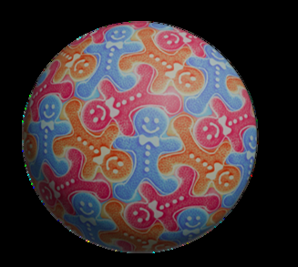

  

<h1 align="center">Generative Spherical Orbifold</h1>

  Escher-style tilings, generated from a text prompt and wrapped seamlessly around a sphere. 
  Emilio Sánchez-Harris &amp; <a href="https://github.com/nikhitrivedi1">Nikhil Trivedi</a>, advised by Dr.&nbsp;Crane Chen · 2024

---

Give it a prompt ("gingerbread man") and it produces a closed spherical surface tiled
with that shape in the style of M.C. Escher — every figure interlocking with its
neighbors with no gaps and no overlaps, all the way around the sphere.

Built on **[Generative Escher Meshes](https://github.com/thibaultgroueix/GenerativeEscherMeshes)**
(Aigerman &amp; Groueix, SIGGRAPH 2024 — [paper](https://arxiv.org/abs/2309.14564)),
extended from flat tilings to closed spherical surfaces using spherical orbifold Tutte
embeddings. Pictured above: *Gingerbread Man*.

## What's here

- The spherical extension of the planar pipeline: symmetry groups on the sphere,
  spherical Tutte embeddings, and score-distillation sampling against the text prompt.
- `lbfgs-translation/` — the core L-BFGS solver ported from MATLAB to Python/PyTorch
  with CUDA acceleration (our port; the original solver ships with the upstream work).
- Setup via `install.sh` / `requirements.txt`. PyTorch &gt; 2.0 required for the sparse
  solver; developed on CUDA 11.8 + Python 3.8.

## Attribution

This is a public mirror of a collaborative research project. The planar tiling
machinery comes from Generative Escher Meshes (see `license.txt` for upstream terms);
the spherical orbifold extension and the solver port are the project's contribution.
